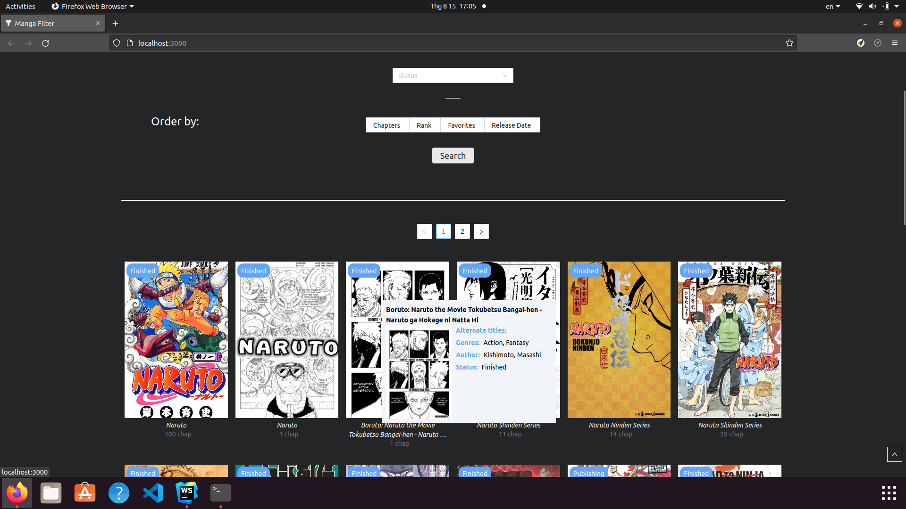

# Manga Filter
Main feature of this project is search for detail of manga

## Scenario
In Vietnam, there are websites posted without copyright,  so I want to create a website that can route to the original poster's homepage. And this project is a part in this plan

## Detail
- Total time taken: ~30h
- Start date: 5/8
- Members: Bùi Công Tri - 20522044
- Framework: React
- Libs: Axios, Tailwind, Antd

## Feature

- Search by name: You can find a specific manga by its name
  


- Advanced Search: You can search in a more advanced way, ex: include genre(s), exclude genre(s), manga status; rank, favorites, release date, chapter quantity in ascending or descending order
  

- Detail pop-up: Having a following cursor pop-up when hover on a manga
 

## Attempt
- Most difficult part: I think the most difficult part of this project is call api and responsive grid. Because this is my first using Axios. At first, I just want to build a basic web without responsive, and when it became complicated, I find a difficult to make this have responsive

- Pop-up problems: I have a trouble about pop-up position. Because, I code each pop-up relate to its card position. I spend about 2 hours for searching solution. And I found that I just need to use 'position: fixed' to make it relate to window =))

## Build Notes
```
# Clone project 
git clone https://github.com/LuxionRob/manga-filter.git
# Install dependencies
cd manga-filter
npm i
# Run
npm start
# Or build
npm run build 
```

###### Web: http://manga-filter.herokuapp.com/
